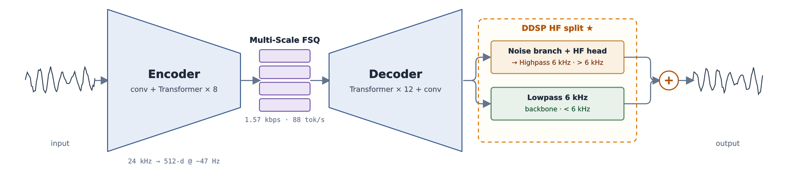

# Spine

[](https://pytorch.org/)
[](LICENSE)

A neural audio codec for expressive speech.



Spine encodes 24 kHz mono audio into multi-scale [FSQ](https://arxiv.org/abs/2309.15505) tokens at 1.57 kbps (~88 tokens/s) across four temporal scales (~6 / 12 / 23 / 47 Hz), keeping sequences short for downstream language models. The convolutional decoder is hard-bandlimited at 6 kHz by a fixed crossover; a filtered-noise branch and a complex-STFT head synthesize the high band under purely adversarial supervision, eliminating the high-frequency static typical of GAN codecs.

- 115M-parameter generator: conv encoder/decoder with a 512-d transformer bottleneck (8 + 12 layers)
- Multi-scale FSQ (`pool → quantize → repeat`) on a shared latent, with no codebook collapse
- Reconstruction losses bandlimited below the crossover; the high band is owned by the DDSP split

## Installation

```bash
uv sync
```

## Usage

```bash
spine encode --checkpoint spine.pt --input speech.wav --output codes.pt
spine decode --checkpoint spine.pt --input codes.pt --output speech.wav
spine recon  --checkpoint spine.pt --input speech.wav --output roundtrip.wav
```

```python
import torchaudio
from spine import Spine, ModelConfig

model = Spine(ModelConfig()).eval()
audio, sr = torchaudio.load("speech.wav")  # 24 kHz mono
codes = model.encode(audio.unsqueeze(0))
reconstruction = model.decode(codes)
```

## Training

```bash
spine train --config configs/train.yaml
```

YAML configs are sparse overrides on top of the defaults in `spine/config.py`.

## Acknowledgements

The architecture builds on [Mimi](https://arxiv.org/abs/2410.00037), [SNAC](https://arxiv.org/abs/2410.14411), [DAC](https://arxiv.org/abs/2306.06546), [FSQ](https://arxiv.org/abs/2309.15505), and [DDSP](https://arxiv.org/abs/2001.04643).

